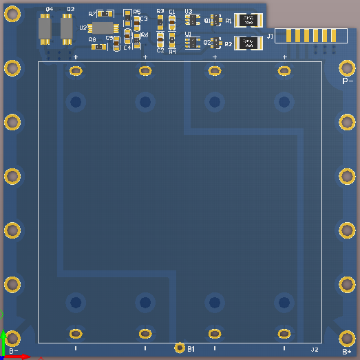
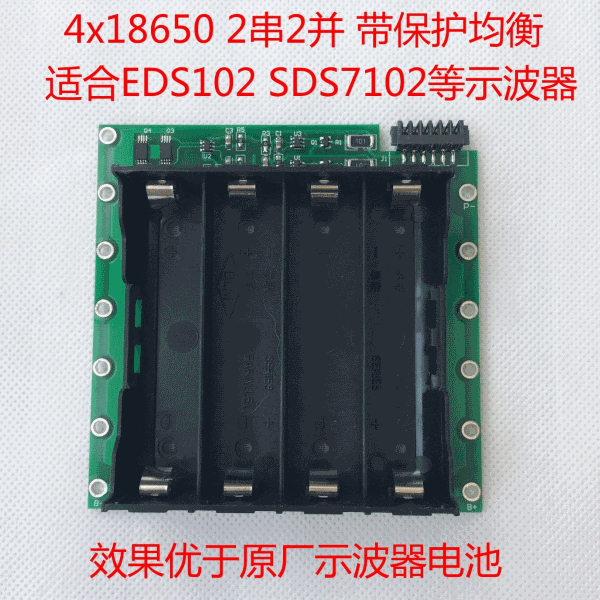
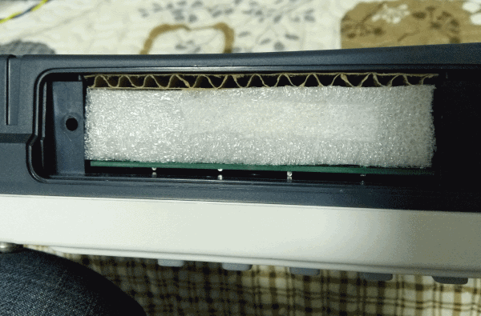
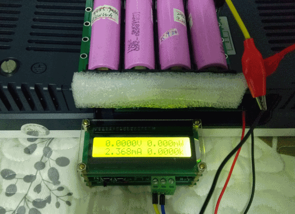
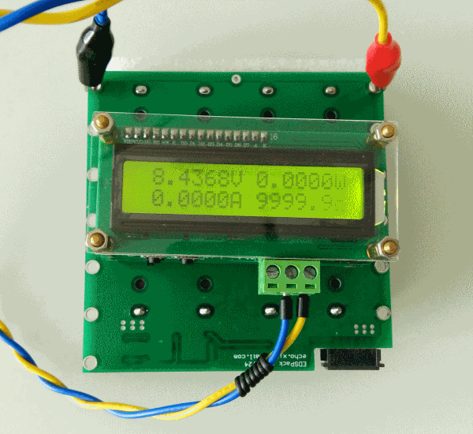
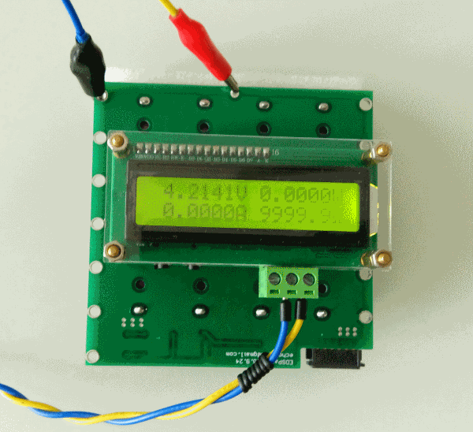
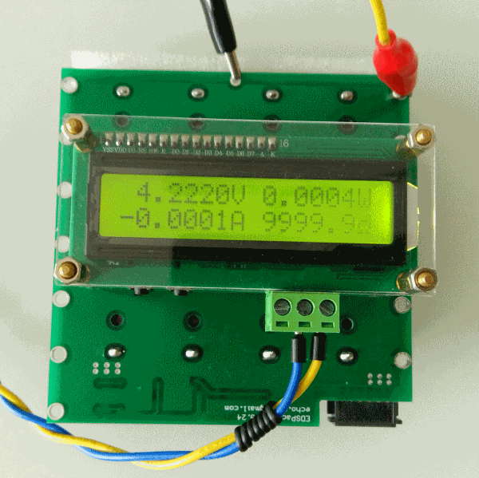

# EDSPack用户手册
EDSPack是一款电池组模块，可以用于OWON的一系列示波器，包括但不限于EDS102CV、
SDS7102等型号。EDSPack可以方便地更换18650电池，更换电池无需焊接。EDSPack
本身具备完善的保护和均衡功能，可以最大限度提高电池循环寿命。

## 参数与接口

### 基本参数

基本参数见下表：

|       指标   | 说明    | 备注     |
|:------------:|:-------:|:--------:|
| 电池安装位置 |  4      |          |
| 电池连接方式 | 2串2并  |          |
| 电压         | 7.4V    |          |
| 充电限制电压 | 8.4V    |          |
| 保护方案     | FS3332C |          |
| 均衡方案     | MM3513  |          |

### 端子布局

主板端子布局和实物图见下图：
 

 

### 端子说明
端子与主要器件见下表:

|   端子号     | 功能                   | 备注         |
|:------------:|:----------------------:|:------------:|
| J1           | 示波器连接端子         | 6P 2.5mm间距 |
| B1-B4        | 电池座                 | 均为上正下负 |
| B+           | 电池组正极             |              |
| B-           | 电池组负极             |              |
| P-           | 经过保护电路以后的负极 |              |

## 使用指南

### 电池选择与安装

EDSPack可以安装4节18650电池，4节电池两串两并，B1与B2并联，B3与B4并联。

电池安装之前，需要保证4节电池电压相同，可以使用万用表检查电池电压。
如果电压不同建议使用同一个充电器将4节电池电量充满，然后依次装入。

注意：
 1. 电池装入时，一定注意正负极，电池接反可能导致设备损坏，火灾等严重的后果。
 2. 电池首次装入以后，EDSPack默认处于放电保护状态，需要充一下电激活，该现象
    为保护电路的正常逻辑。

EDSPack可以兼容多种18650电池：
- 追求大容量可以选择4节松下NCR18650B 3400mAh电池，电池组容量6800mAh,7.4V
- 或者4节LGABF1L1865,3350mAh电池，电池组容量6700mAh，7.4V
- 或者4节LGDBMJ11865-3500mAh电池，电池组容量7000mAh，7.4V
- 追求性价比可以选择4节三星2600mAh电池，电池组容量5200mAh，7.4V
- 追求更好的性价比可以选择国产电池或者拆机电池，使用拆机电池需要具备电池容量
  测试能力，务必选择4节**相同品牌容量接近**的电池。

### 示波器安装

示波器安装以EDS102C为例。

将示波器底部电池仓盖取下，示波器屏幕朝下，放置到软台面上（如床沙发等），
保护示波器正面旋钮与按键。

将EDSPack装入电池后推入示波器电池仓，注意保持EDSPack与电池仓左右缝隙接近。

EDSPack完全推入以后，顶部仍然有一定空间，塞入一张约10x10cm的厚纸板，保证EDSPack
不会上下晃动，装入以后效果见下图：

使用柔软物体，如泡沫，填充EDSPack与示波器电池盖板之间的空隙，将示波器电池仓盖板装上。

EDSPack如果没有激活，将示波器交流电源线插入，连接市电即可激活电池组。
 
### 连线使用

EDSPack也可以使用于其它需要7.4V电池组供电的场合。

通过B+和B-焊盘焊线，直接从7.4V电池组取电，不经过保护板，保护电路失效，
均衡电路依然生效。

通过B+和P-焊盘焊线，经过保护板，保护电路与均衡电路均生效。实际上J1端子
连接B+和P-两个焊盘网络。

## 性能测试

### 电流测试

以EDS102CV为例，正常工作电流约1.85A。示波器关闭以后，电流约2.3mA，以此可以
估算电池使用时间。
 

 

5200mAh电池组正常使用时间为`5.2/1.85=2.8`小时。待机时间为`5200/2.3/24=94`天。

其余电池组容量可以按照此公式计算。

注意：*EDS102CV示波器电池输入静态电流偏大，约2.3mA，长期闲置会将电池组电放光，
隔一段时间需要将示波器充一次电。这是示波器本身的问题，不是电池组的问题*。

### 电压测试

EDSPack在示波器中充满电以后，电压见下图所示：
 

 

 

## 更多信息

[购买链接](https://item.taobao.com/item.htm?spm=a1z10.1-c.w4004-9102396040.29.17d11e5fmlPS4n&id=522970098585)

